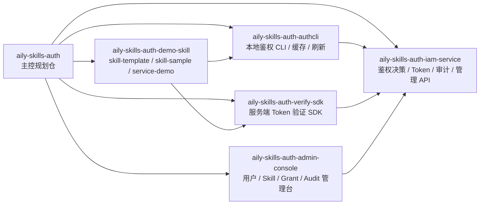
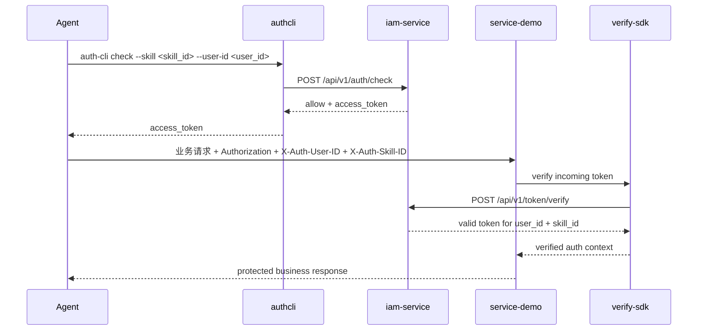

# Aily Skills Auth

`aily-skills-auth` 是企业 Agent Skill 鉴权平台的主控规划仓。

这个仓库不承载生产实现代码，职责是沉淀以下资产：

- `0.2.0` 规划冻结与子仓任务书
- 整体架构文档与依赖拓扑
- 接口契约与领域模型
- 测试策略、验收矩阵、部署蓝图
- 子项目可复用模板与协作规范

## 当前状态

- `0.1.0-alpha` 已完成 MVP 验证
- 当前阶段进入 `0.2.0` 规格收敛与文档重构
- 本轮只更新主控仓，不在这里实现子仓生产代码

## 仓库定位

- 类型：模板与规范资源仓
- 目标：为后续多仓库实施提供唯一规划入口
- 非目标：不在本仓库实现 `iam-service`、`authcli`、`verify-sdk`、`admin-console`

## 子项目关系图

正式图版本见 [docs/architecture/diagrams/repo-topology.md](/Users/wenzhewang/workspace/codex/aily-skills-auth/docs/architecture/diagrams/repo-topology.md)。

## 调用时序图

正式图版本见 [docs/architecture/diagrams/request-sequence.md](/Users/wenzhewang/workspace/codex/aily-skills-auth/docs/architecture/diagrams/request-sequence.md)。

## 子项目索引

| 仓库 | 角色 | 技术栈 | 状态 |
|------|------|--------|------|
| `aily-skills-auth` | 主控规划/资源仓 | Markdown/YAML | `0.2.0` 规划中 |
| `aily-skills-auth-iam-service` | 鉴权决策、签发、撤销、审计、管理 API | Python + FastAPI | `0.2.0` 待按新模型重构 |
| `aily-skills-auth-admin-console` | 管理控制台 | React | `0.2.0` 启动 MVP 规格 |
| `aily-skills-auth-authcli` | 本地鉴权 CLI | Go | `0.2.0` 待收敛命令面与帮助文案 |
| `aily-skills-auth-verify-sdk` | 服务端验证 SDK | Python first | `0.2.0` 待跟随最小 token 契约调整 |
| `aily-skills-auth-demo-skill` | skill-template + skill-sample + service-demo | Bash/Python | `0.2.0` 待重构样板职责 |

## 文档入口

- 总览：[docs/README.md](/Users/wenzhewang/workspace/codex/aily-skills-auth/docs/README.md)
- V3 蓝图：[docs/architecture/enterprise-agent-auth-v3.md](/Users/wenzhewang/workspace/codex/aily-skills-auth/docs/architecture/enterprise-agent-auth-v3.md)
- 仓库拓扑图：[docs/architecture/diagrams/repo-topology.md](/Users/wenzhewang/workspace/codex/aily-skills-auth/docs/architecture/diagrams/repo-topology.md)
- 调用时序图：[docs/architecture/diagrams/request-sequence.md](/Users/wenzhewang/workspace/codex/aily-skills-auth/docs/architecture/diagrams/request-sequence.md)
- 子项目拆分：[docs/roadmap/repo-splitting-plan.md](/Users/wenzhewang/workspace/codex/aily-skills-auth/docs/roadmap/repo-splitting-plan.md)
- `0.2.0` 阶段路线：[docs/roadmap/implementation-phases.md](/Users/wenzhewang/workspace/codex/aily-skills-auth/docs/roadmap/implementation-phases.md)
- 部署蓝图：[docs/roadmap/deployment-blueprint.md](/Users/wenzhewang/workspace/codex/aily-skills-auth/docs/roadmap/deployment-blueprint.md)
- Domain Model：[docs/contracts/domain-model.md](/Users/wenzhewang/workspace/codex/aily-skills-auth/docs/contracts/domain-model.md)
- Admin API：[docs/contracts/admin-management-api.md](/Users/wenzhewang/workspace/codex/aily-skills-auth/docs/contracts/admin-management-api.md)
- Skill 模板规范：[docs/templates/skill-template-spec.md](/Users/wenzhewang/workspace/codex/aily-skills-auth/docs/templates/skill-template-spec.md)
- Demo Skill 集成说明：[examples/demo-skill-integration.md](/Users/wenzhewang/workspace/codex/aily-skills-auth/examples/demo-skill-integration.md)
- 注册表：[registry/subprojects.yaml](/Users/wenzhewang/workspace/codex/aily-skills-auth/registry/subprojects.yaml)

## GitHub 同步原则

- 本地目录与 GitHub 仓库 `aily-skills-auth` 一一对应
- 该仓库只同步文档、模板、规范和示例
- 子仓的跨仓接口变更必须先回写主控仓，再进入实现仓

## 当前完成标准

当前阶段完成，需满足：

- `0.2.0` 主文档可直接指导子仓实施
- 子项目边界、状态与注册表同步更新
- 契约文档与测试矩阵按最小模型冻结
- Demo Skill 模板和 Admin Console MVP 规格可直接开工
