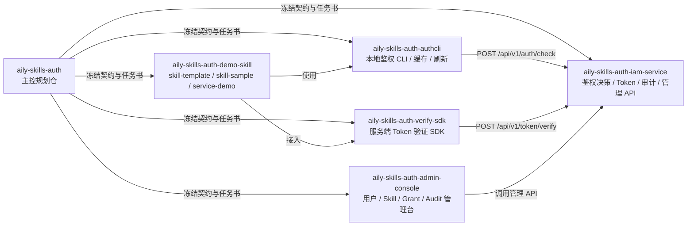

# Repo Topology

以下图用于说明主控仓与各子仓在 `0.2.0` 的固定关系。

说明：

- `authcli` 与 `verify-sdk` 都只依赖 `iam-service`
- `demo-skill` 不直接接入数据库或管理 API
- `admin-console` 在 `0.2.0` 的目标是 `Users`、`Skills`、`Grants`、`Audit` 四类管理能力
