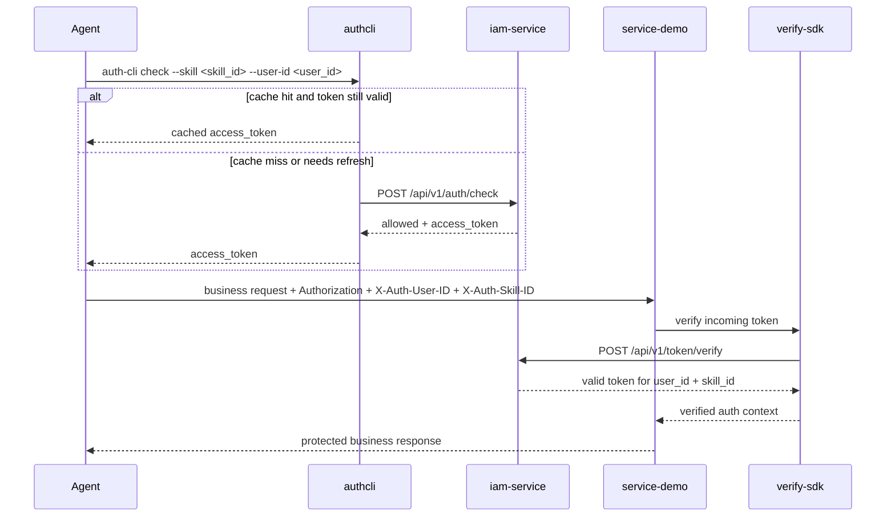

# Request Sequence

以下图用于说明 `0.2.0` 的标准调用链路。

固定语义：

- 所有关键服务调用前，必须先执行 `auth-cli check`
- 所有关键服务调用必须携带 `Authorization: Bearer <access_token>`
- 服务端不重算授权策略，只通过 `verify-sdk` 调 `iam-service` 做 token 验证
